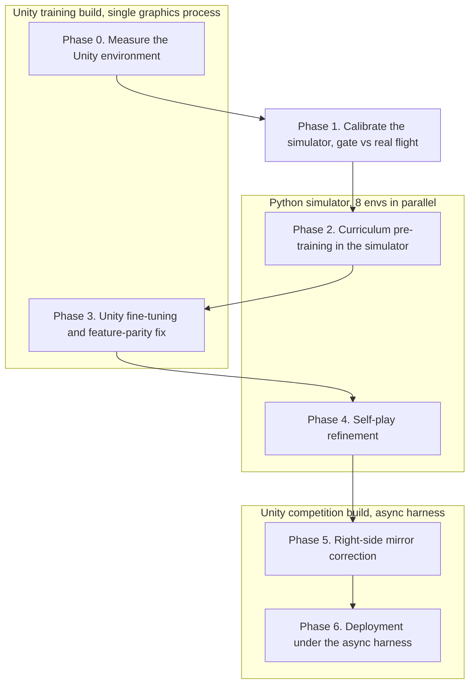

# Development and Training Process

This document describes, phase by phase, how the dPickleBall agent was
built, calibrated, trained, and validated. For setup and how to run each
step, see [README.md](README.md).

## Objective

dPickleBall is a two-player Unity pickleball game in which each side's
paddle is driven by a Python policy. The policy receives a real-time
visual frame and outputs three discrete action components, each in
`{0, 1, 2}`. Vertical is none, up, or down. Horizontal is none, right, or
left. Rotation is none, ccw, or cw. The agent must rally, receive serves,
and score. The first side to 21 points wins, the previous point's winner
serves next, and a ball left stuck on one side for more than five seconds
concedes a point. The policy must return an action within roughly 10 ms
per step or the previous action is reused.

The agent is a single shared side-aware policy that drives both paddles
from one TorchScript checkpoint, with no training framework needed at
inference. The rest of this document follows the chronological pipeline by
which it was built.

## Design approach

The agent is an object-centric feature-based PPO policy rather than a
raw-pixel convolutional network. Two hard constraints drove this.

**Latency.** The 10 ms CPU budget per step rules out a deep CNN with a
frame stack. A compact 16-dimensional feature vector through a small
multilayer perceptron evaluates in well under a millisecond, which leaves
headroom for two policies sharing one machine.

**Sim-to-real transfer.** Object-centric features of ball and paddle
positions and velocities close most of the gap by construction. The policy never
observes rendering, only geometry, so the only thing left to calibrate
between simulator and real game is the dynamics.

Training is a staged pipeline, each stage gated before the next begins.
The pure-Python simulator is cheap and runs eight environments in
parallel, so it carries the bulk of the learning. The Unity build is
expensive at about 47 steps per second on a single graphics process, so it
is reserved for measurement, fine-tuning, and validation.

## The 16-dimensional feature contract

An OpenCV extractor converts each raw frame into a fixed 16-dimensional
feature vector normalized to `[-1, 1]`. It uses HSV colour segmentation to
locate the yellow ball and the orange paddles inside a court region of
interest, and derives ball velocity from the difference between
consecutive frames. On real frames it detects the paddles essentially all
the time and the ball almost always while it is on court, at about 0.24 ms
per frame.

The identical vector layout is produced two ways, from ground-truth state
inside the simulator during training and from the extractor on the real
frame at deployment. Keeping these paths identical is load-bearing. A
silent mismatch breaks transfer, as Phase 3 shows.

| idx | feature | idx | feature |
|----|---------|----|---------|
| 0,1 | ball x, y | 8,9 | ball-paddle relative x, y |
| 2,3 | ball vx, vy | 10 | time on own side, zeroed |
| 4,5 | paddle x, y | 11 | success count, zeroed |
| 6,7 | paddle sin, cos, fixed vertical | 12,13 | ball and paddle visibility |
| 14 | side sign, +1 right and -1 left | 15 | opponent y |

Two environment facts shape this contract. First, the visual observation
is populated only on the first agent, the left, and both paddles read the
same shared image. Second, the action mapping is global and screen-space,
identical for both paddles. A single shared policy therefore needs an
explicit cue for which side it controls. That cue is the side-sign feature
at index 14.

## Phase 0. Measuring the environment

Before writing any learning code, the environment was characterised
empirically. A recorder launched the Unity build through the ML-Agents
interface and saved chunks of frame, action, and reward data under several
action regimes, namely uniform random, single-branch sweeps that isolate
one action component at a time, a scripted square pattern, and a
closed-loop chaser, for about 53,000 steps in total. These recordings
established the facts every later decision relied on.

- Graphics needed. A headless launch crashes because the observation
  is a rendered camera image.
- The build runs at about 47 steps per second. The first agent is the left
  paddle and the second is the right.
- The visual observation is a `(3, 84, 168)` float image in `[0, 1]`,
  present only on the first agent, and both paddles share it.
- Actions are global and screen-space, identical for both paddles.
- Reward is +1 to the scorer and 0 to the opponent, not plus or minus one,
  and the environment never emits a terminal done, so match end is tracked
  externally.
- The competition build registers its communicator slowly and needs a
  longer handshake timeout than the training build.

These facts are recorded in
[agent/MEASUREMENTS.md](agent/MEASUREMENTS.md).

## Phase 1. Calibrating the simulator

The recorded tracks were turned into a calibrated physics model. The
extractor was run once over every recorded frame and cached as object
tracks, and a system-identification step then fitted the simulator
constants from those tracks. The simulator integrates at 30 FPS using
explicit Euler steps, with ball motion under drag, reflection off the top
and bottom walls, rotated-rectangle paddle capture, a hit response, and
scoring at the left and right x-lines. The principal fitted constants
follow.

| parameter | value | parameter | value |
|-----------|-------|-----------|-------|
| court ball x-range | 9.5 to 163.5 | paddle v and h speed | 0.82 and 0.70 px/step |
| top and bottom walls, y | 21.5 and 79.5 | ball drag per step | 0.998 |
| left and right paddle x | 21-82 and 85-147 | gravity | 0, measured |
| paddle y-range | 24 to 78 | wall restitution | 1.0 |
| ball radius and paddle | 3 and 12x6.5 px | hit out-speed | 0.55 in + 1.05 paddle + 0.6 |

One calibration decision is worth highlighting. The raw drag fit was 0.982
with a large standard deviation of 0.237, dominated by slow jittery balls.
A drag of 0.982 makes a serve stall near mid-court, which is physically
wrong because balls demonstrably cross the roughly 150 px court and rally.
Drag was therefore corrected to 0.998, a case where a physical constraint
correctly overrode a noise-dominated measurement. A replay gate validated
the result. Simulated free flight matched real Unity ball flight to a mean
error of 0.36 to 0.41 px over 30 frames, well inside the 2 px gate. Details
are in [agent/CALIBRATION.md](agent/CALIBRATION.md).

## Phase 2. Curriculum pre-training in the simulator

The simulator is wrapped as a single-agent RL environment with two
deliberate choices. The controlled side alternates every episode, which
prevents over-fitting one side. And half of all episodes are receive, in
which a ball is served at the agent, while the other half are self-start,
in which a near-stationary ball at the agent's home must be actively
pushed out. The self-start half removes any incentive to camp passively. A
camper is given no incoming ball to intercept and simply loses.

Skill is built through a five-level curriculum. Advancement requires at
least 80% success overall and at least 75% on each side, over 50
evaluation trials, where a successful trial means five clean returns
within an episode.

| level | serve speed | angle | opponent | domain rand. |
|-------|-------------|-------|----------|--------------|
| 1-3 | slow to fast | narrow to wide | ball launcher | no |
| 4 | mixed | wide | scripted returner | no |
| 5 | mixed | wide | scripted returner | yes |

The reward is intentionally lean and event-based, a deliberate departure
from dense per-step shaping, which is prone to reward-farming. The agent
receives +1.0 for a counted return, when the ball clears past mid toward
the opponent after the agent hits it, and -1.0 for a failure, when it is
scored on or lets the ball sit on its own side for the five-second
timeout. A one-shot +0.2 bonus for first contact with an incoming ball is
annealed to zero by level 3. Anti-camping is structural rather than
penalised, since a soft tap that never crosses mid does not count as a
return.

The policy is trained with PPO from Stable-Baselines3, an MLP with two
hidden layers of 128 units over the MultiDiscrete `[3,3,3]` action space.
Hyperparameters are learning rate 3e-4, 1024 steps per rollout, batch size
256, 8 epochs, discount 0.995, GAE lambda 0.95, clip 0.2, and entropy
coefficient 0.01, across eight parallel sub-process environments.
Checkpointing keeps the top three models by score under a hard per-side
floor. Any candidate whose left and right success rates differ by more
than 0.15 is ineligible, which guards against a policy strong on one side
and weak on the other.

Several bugs surfaced and were fixed during this phase, most caught by a
heuristic sanity rollout rather than by metrics. These were the drag
correction above, a self-start ball with zero velocity that failed a
moving-toward-paddle check and so could never be launched, which made half
of all episodes unwinnable, an episode cap raised from 600 to 900 steps so
slow rallies fit five returns, a domain-randomization bug in which
multiplicative jitter pushed drag and restitution above 1.0 and stalled
level 5, fixed with tight absolute ranges clamped at 1.0, and a
training-loop bug that stopped at the first level-5 pass before banking a
side-balanced checkpoint. After these fixes the policy cleared all five
levels with balanced sides, at success rates 1.00, 1.00, 1.00, 0.98, and
1.00.

## Phase 3. Unity fine-tuning and the parity fix

Fine-tuning drives both paddles in the live Unity build, the learner on an
alternating side and a frozen TorchScript copy on the other, with reward
equal to own minus opponent points and episodes truncated at a fixed
length since the build emits no terminal signal. This phase exposed the
most important issue in the project. Despite healthy training metrics, the
agent flailed in Unity and could barely touch the ball. The
win-against-a-frozen-copy metric was blind to it because both paddles were
equally broken.

A diagnostic compared the feature distribution the policy trained on
against what the extractor produced at deployment, and found three
mismatches. The paddle-orientation feature ranged over `[-0.54, 0.54]` in
the simulator but `[0, 1]` from the extractor, because the extractor's
minimum-area-rectangle angle folds into `[0, pi/2]` and cannot represent
tilt direction. The time-on-own-side and success-count features were live
in the simulator but always zero at deployment, being unmeasurable from a
single frame. And ball velocity saturated at plus or minus one in Unity,
because the normalization scale was too small and occlusion-recovery
produced spurious velocity spikes.

The fixes restored parity. Rotation was neutralized. The paddle is kept
vertical everywhere, the extractor reports a fixed vertical angle, and the
agent instead angles its shots through vertical paddle motion at the
moment of contact. The two unmeasurable features were zeroed inside the
simulator to match deployment, and the velocity normalization scale was
widened from 4 to 8 with an occlusion-jump guard that discards
frame-to-frame ball displacements above a physical threshold. After
re-auditing that the distributions matched, the re-pre-trained policy
rallied in Unity with zero fine-tuning, sustaining a mean of about 332
steps between points against the 20 to 40 of the flailing version. The
lesson became a standing rule. Feature parity between training and
deployment is essential, and rally length, not win-rate against a copy of
oneself, is the trustworthy measure of absolute competence.

## Phase 4. Self-play

The final training phase refined the policy through competitive self-play.
A bounded pool holds up to six frozen TorchScript snapshots of earlier
versions, including a permanently pinned baseline so the learner always
faces at least one fixed floor opponent and cannot drift into a degenerate
cycle. The environment samples one opponent per episode. The reward is the
raw points difference, which, unlike the returns-based objective, does not
saturate while the pool stays competitive. Resuming the fine-tuned model
and training against the pool at the hardest domain-randomized level
produced the final agent, which retained balanced near-ceiling performance
across the curriculum, at level success rates 1.00, 1.00, 0.94, 0.94, and
0.98.

## Phase 5. Correcting a residual side asymmetry

A final issue surfaced only once the agent was driving both paddles in
real competition self-play. The shared policy committed to the net
decisively on the left, but on the right it sat too deep and oscillated,
losing same-policy self-play games by roughly four to one in the left
paddle's favour. The cause is rooted in the observation. Features are
absolute pixel coordinates plus a side-sign flag, not a mirror-canonical
frame. Vertical ball tracking is side-independent and transferred cleanly,
but the horizontal net-positioning behaviour learned the left paddle's
coordinate regime and did not generalise to the right through the
side-sign cue alone. The per-side training floor had gated only the
vertical receive return-rate, so this purely horizontal positional
asymmetry slipped past it.

The correction needs no retraining. Because the court is left-right
symmetric about the image centre, the right paddle's frame is mirrored
horizontally before it reaches the policy, presenting every right-side
situation in the left-side frame where the policy is strongest. The
policy's horizontal and rotation actions are then mirrored back to real
screen directions. The right paddle thereby acts as the exact mirror of
the strong left paddle. On the competition build this turned same-policy
self-play from the prior four-to-one left advantage into a dead-even
result, confirming that the right side now matches the left.

## Phase 6. Deployment under the async competition harness

The competition runner does not call the policy in lockstep. It runs each
side's policy in a background thread and steps the environment with the
previous action as a fallback, so a slow policy simply reuses its last
action and every action lands about one step late. Two deploy-time issues
surfaced only under this harness, and both are fixed without retraining.

First, thread safety. The harness advances Unity while the policy thread
is still reading the observation, and the observation buffer can be reused
mid-read. The policy therefore copies the frame on entry so it owns the
pixels for the duration of the call.

Second, a paddle hop. Instrumenting the real deployed path, logging the
detected ball and paddle positions and the chosen action per step, showed
the policy is almost a pure bang-bang controller. It commands up or down
on nearly every step and rarely holds, even when already aligned with the
ball. In lockstep that tracks tightly, but under the one-step action lag
each near-alignment command overshoots before the reversing command lands,
producing a sustained oscillation of a few pixels, the visible hop, which
occasionally misses a fast ball. The detected positions were clean, so
this was control, not vision. The fix is a vertical deadband that holds
when the ball is within a few pixels of the paddle centre. It reads the
existing relative-position feature, is mirror-invariant so it serves both
sides, and cut the action reversal rate on the real path from about 13% to
under 2%. Against the strongest opponent on the real competition harness,
this turned a losing right side into a win and left the strong left side
unchanged.

The submission is the competition's required form directly, teamX.py and
teamY.py plus one checkpoint. teamX.py is self-contained with its own
extractor, feature contract, and policy, teamY.py reuses it mirrored, and
both load the checkpoint from checkpoints/ beside them.

## Results and verification

| metric | value |
|--------|-------|
| simulator levels 1-5 | 1.00, 1.00, 0.94, 0.94, 0.98, side-balanced |
| Unity rally length, deploy path | about 416 steps per point |
| competition self-play balance | even after the right-side mirror fix, was about 4:1 left |
| vs strongest opponent, async harness to 21 | wins both sides after the deadband fix |
| paddle action-reversal rate, real path | about 13% down to under 2% with the deadband |
| inference latency | p50 0.43 ms and p99 0.70 ms, budget 10 ms |
| unit tests | passing for features, physics, reward, extractor |

On the real competition build the agent plays complete real-time games and
sustains long rallies. Measured rally competence is equivalent on the
competition and training builds, a mean gap of 306 versus 332 steps per
point, the same within noise, confirming that the simulator-trained
Unity-fine-tuned policy transfers to the build that decides matches. To
meet the inference budget the deployed policy pins PyTorch to a single
thread and performs a short just-in-time warm-up, so the first slow calls
are paid before play begins. The measured 99th-percentile latency of
0.70 ms leaves a wide margin under the 10 ms limit.
